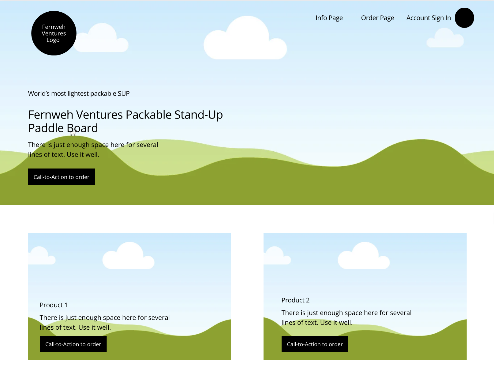
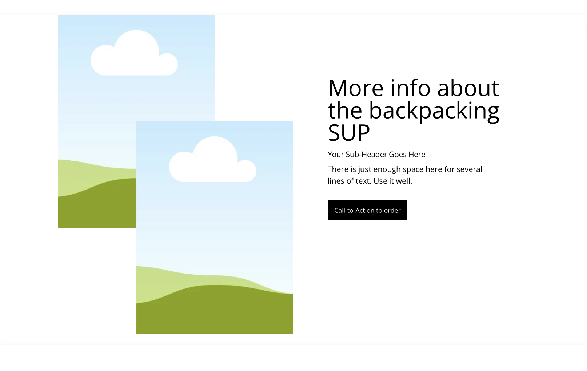
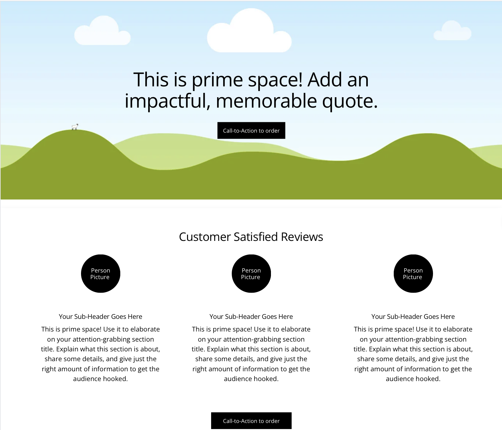
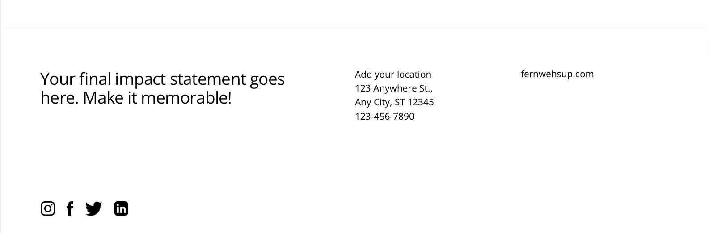
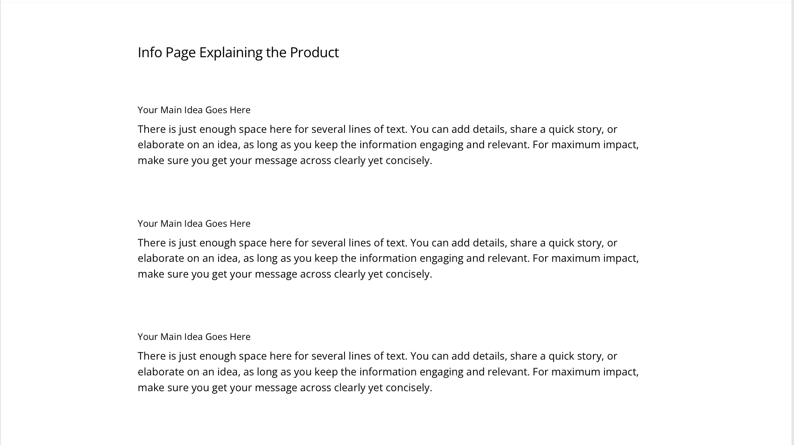
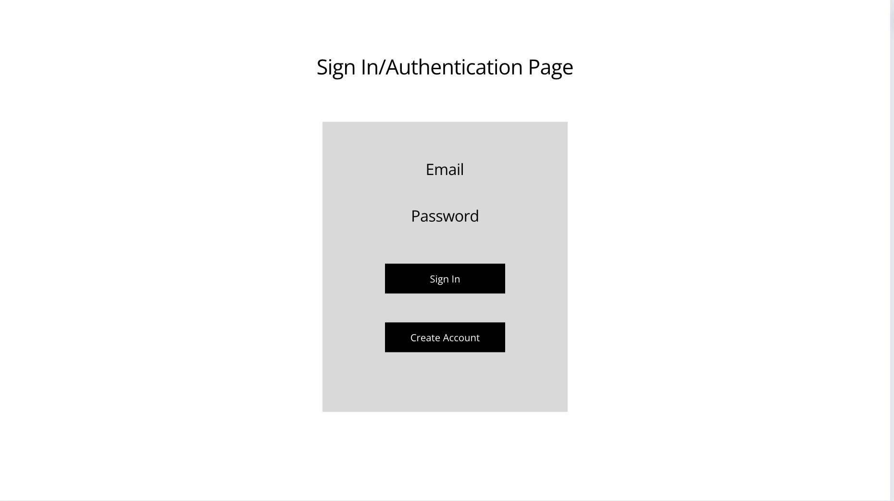
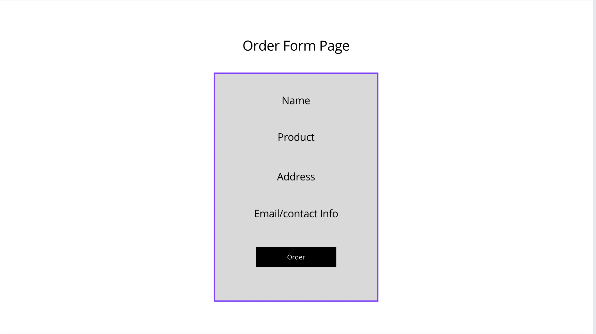

# Welcome to Fernweh Ventures
[Fernweh Ventures Stand-Up Paddle Board Website](https://fernwehsup.com)
# Deliverable Specification
## Elevator Pitch
Welcome to Fernweh Ventures, your gateway to adventure! At Fernweh Ventures, we've redefined the way you explore the great outdoors. Imagine packing up your sense of wanderlust, your thirst for adventure, and your love for paddleboarding into one lightweight backpack. With our innovative, packable, and inflatable stand-up paddle boards, you can now embark on backpacking trips like never before.

Our paddle boards are designed to be your trusty companions on the road less traveled. They're not just incredibly portable; they're also durable and high-performing on the water. Whether you're conquering tranquil lakes, meandering down serene rivers, or taking on challenging rapids, Fernweh's paddle boards rise to the occasion.

We understand the thrill of discovering hidden waterways and breathtaking vistas in the heart of nature, and we're here to make those experiences more accessible than ever. With Fernweh Ventures, adventure fits in your backpack, and nature becomes your playground.

Join us in embracing the Fernweh spirit – the irresistible call of the wilderness. Explore, paddle, and discover with Fernweh Ventures – where adventure knows no boundaries.

## Website Outline Design
**Main Page Canva Sketch**

**Info Page Canva Sketch**

**Sign In Form Canva Sketch**

**Order Form Canva Sketch**

## Key Features
- **Product Catalog:** displays the catalog of packable stand-up paddleboards, including images and price ranges.
- **User Accounts:** allows users to create accounts and save their information.
- **Secure Checkout:** form that uses a safe and user-friendly checkout process.
- **Product Review and Ratings:** allow customers to vote on products for other customers to see.
- **Responsive Design:** fully responsive website that looks well on various devices, including smartphones.

## Technologies

- **HTML:** used to structure the content of the web pages, including product descriptions, images, and pricing information. Also used to create the order and contact forms.
- **CSS:** used to style the HTML elements to ensure that the website has an appealing and user-friendly design. Used to customize layout, colors, fonts, and overall look to match the brand. Additionally, used to make website responsive to different screen sizes, including mobile devices.
- **JavaScript:** adds interactivity through smooth animations/transitions anddynamic elements like image sliders. Also implements client-side validation for forms to ensure data accuracy.
- **Backend Service:** handles server-side operations like processing orders, managing user accounts, and handling payments.
- **Database:** stores product information, user data and order history in a database.
- **Login Authentication:** implements user authentication and authorization mechanisms to allow users to create accounts and log in.
- **WebSocket:** enables real-time communication between the server and the client, implements real-time notification for order updates and a collaborative shopping experience where users can see how many orders have been placed and customer reviews.
- **React:** creates a smooth and responsive user experience, application ported to the React web framework.

## HTML Deliverable
For this deliverable I built out the structure of my application using HTML.

- **HTML pages** - Four HTML pages that represent the home page, the ability to learn more about the company and products, sign in and order the products of choice.
- **Links** - Each page holds links to the other pages. There are also call-to-action buttons on the home page that link to the about, order and sign in pages.
- **Text** - There are textual descriptions throughout the pages describing the company and the products offered.
- **Images** - Images are included in about every section.
- **Login** - There are Input boxes and submit buttons for login.
- **3rd party service calls** - There is a placeholder for using Paypal integration to hold credit card info for ordering products.
- **Database** - There are placeholders for showing order history and account history from a database.
- **WebSocket** - There is a placeholder for showing real-time customer reviews on the about page.

## CSS Deliverable
The website is properly styled into its final appearance, utilizing the Bootsrap CSS structure.

- **CSS pages** - 4 CSS pages that have custom styling and bootstrap elements.
- **Header, footer, and main content body**
- **Navigation elements** - Dropped the underlines and changed the color for anchor elements
- **Responsive to window resizing** - Looks great on all window sizes and devices
- **Application elements** - Uses good contrast and whitespace
- **Application text content** - Consistent fonts
- **Application images** - Appropriate images for the products and hero elements

## JavaScript Deliverable
The website now has JavaScript enabled capabilities described below. There are also added placeholders for future technology.

- **login** - When the user presses various buttons, it takes them to the proper pages.
- **database** - User login and customer review data is currently stored in local storage but holds a placeholder for future database communication.
- **WebSocket** - There's a placeholder present for a WebSocket connection to display real-time customer reviews on the about page.
- **application logic** - For submission forms and other buttons there is simple logic to go between pages.

## Service Deliverable
The website now has backend endpoints that receives order and products.

- **Node.js/Express HTTP service created**
- **Static Middleware for frotend created**
- **Calls to third party endpoints** - there is a placeholder for accessing info in my MongoDB database .
- **Backend service endpoints** - There are endpoints for accessing my mongoDB database for order and product history. There is also a placeholder for login that stores the current user on the server.
- **Frontend calls service endpoints** - Done using the fetch function
